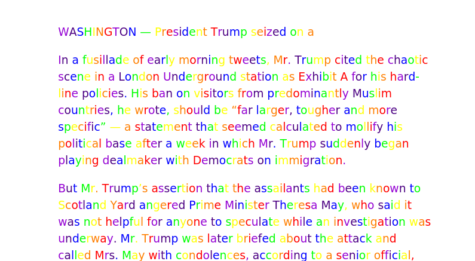

This plugin makes serious news sites and blogs funny again. With it's four modes you have limetless possibilities to view the news through rose colored glasses.

For example, take [this](https://www.nytimes.com/2017/09/15/us/politics/trump-seizes-on-london-attack-to-push-for-expanding-a-travel-ban.html) serious NewYork Times Article.

### EPIC TRANSLATE CIRCLE
This modes puts the content of the site sequentially trough 10 (yes, you heard it right, TEN) translations and than back to the original language using the power of google translate. The boring article of above now looks something like this:

### EMOJI MODE
For the youngsters in this world that only know how to read emoji, this mode is perfect. It translates the text to emoji! For example `he looks dead` becomes :man: :eyes: :skull:. This way everyone can enjoi the ~~boring~~ articles online.

### RAINBOW MODE
Everyone likes rainbows, right?! Well, guess what! This mode changes into RAINBOWS!

